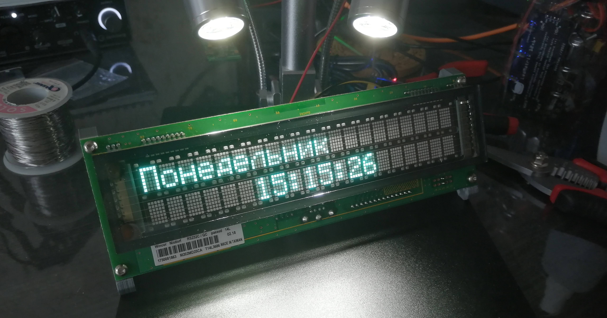

# GotchauClockVFD

Элементарные часики на базе вакуумно-люминесцентного индикатора M202MD25. Экран имеет две строки по 20 символов. Работает как с латиницей, так и кириллицей.



# Подключение

В углу дисплея имеется блок перемычек. Необходимо замкнуть перемычку J3. Примерно в центре, рядом с рядом с разъемом похожим на PS/2, находится группа из четырёх контактов CN3. Первый отмечен меткой снизу. Слева и справа нанесены цифры '1' и '4', обозначающие первый и последний контакты. Контакты по порядку: RX, не используется, +12v, GND.

Дисплей общается через Serial, однако сигнал должен приходить в инвертированном виде, поэтому используется библиотека SoftwareSerial:

```c++
#include <SoftwareSerial.h>

...

SoftwareSerial srl(255, 2, true); // Подключаем программный Serial: RX (не используется), TX, инверсия логики (да)
```

Первым аргументом может любое число, так как принимать мы ничего не будем. В данном случае стоит номер контакта далеко выходящий за пределы имеющихся у ESP01.

Схема подключения представлена на рисунке ниже:


Часы поддерживают перепрошивку по воздуху, однако первый всё же придется прошить физически, если у вас уже не был залит на ESP скетч, содержащий в себе ArduinoOTA и плата легко находится по сети средой разработки.

# ТУ-ДУ лист

- [x] прототип
- [ ] реализовать несколько режимов отображения даты, времени, дня недели и тд
- [ ] реализовать словесное отображение времени

 